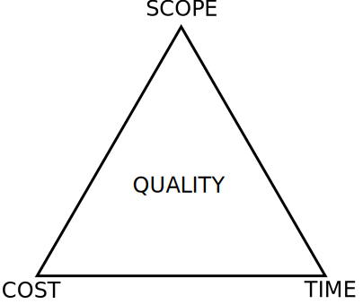

---

# How to be a Senior Contributor

by John Goodwin

---

# Intro

- Metabolon, Inc
  - <https://www.metabolon.com/>
- Principal Software Engineer
- Writing software professionally since 1997

---

## Agenda

- Attendee Intentions
- Definitions
- Motivation
- Master Principle
- Sub-Principles
- Swaps
- Cautionary Tales
- Q&A

---

## Attendee Intentions

At this time, want to ask each person what they hoped this talk would cover.

---

## Definitions

---

### Contributor

_noun_

1. a person or thing that contributes something.

---

### Senior

_adjective_

1. of or for older or more experienced people.
"senior citizens"
synonyms: older, elder; more grown up

2. holding a high and authoritative position.

---

### How

_adverb_

1. in what way or manner; by what means.

---

## Motivation

Why give this talk?

---

### Money

- Senior roles pay more

---

### Payscale.com Average salaries

|         | Accountant | Account Manager  | Product Marketing Manager |
| --------| ---------- | ---------------- | ------------------------- |
| Typical |    $50,757 |          $53,458 |                   $87,784 |
| Senior  |    $66,707 |          $72,506 |                  $122,878 |

|         | Software Developer | Mobile Developer | Software Engineer |
| --------| ------------------ | ---------------- | ----------------- |
| Typical |            $70,515 |          $72,872 |           $84,019 |
| Senior  |           $100,482 |         $110,576 |          $113,962 |

---

Q. Is this just about money?
A. No, salary ladders give insight to what companies value.

---

### Time

Online are many references. Some, like this one:

<http://sijinjoseph.com/programmer-competency-matrix/>

One thing that is evident from online searches:

> There is no fixed length of time before becoming "senior"

---

### Giving Back

Much of what I learned about computers came from books, blog posts, and trial/error. This means I benefited from the generous gift of knowledge from those who figured those things before me.

Not suggesting I am the first person with these perspectives, but, most of what I am telling you today is not from any mentor, or book. I learned this the hard way. Hopefully, the perspectives are useful.

---

## Master Principle

source: <https://en.wikipedia.org/wiki/Project_management_triangle>

---

> The discipline of project management is about providing the tools and techniques that enable the project team (not just the project manager) to organize their work to meet these constraints.

Not a talk on project management, but in a nutshell:

> Being senior is about helping your boss/client do more, with less, and of high quality.

---

## Sub-Principle 1 - Scope

- Coverage aka Features
- Requires learning your stakeholder's values
- Requires valuing your stakeholder's values

---

## Sub-Principle 2 - Time

- Calendar Days vs Person Hours
- Opportunity Window
- Future Reward Discounting - get ref

---

## Sub-Principle 3 - Cost

- Money
- Contributor Hours
- Effort
- Required Contributor Level
- Risks

---

## Sub-Principle 4 - Quality

- Why does quality matter?
- Risks / Cost
- Forward Progress
- Claim vs Reality

---

## Swaps

- We never ... --> How can we ...
- Cube-life ... -> Who can introduce ...
- Confusion ... --> I propose ...
- Seek out new swaps

---

## Cautionary Tales

- Painting Cabinets
- Mobile Team Selection
- Point of Care Upgrades

---

## Q&A

### Questions

---

## Resources

- <https://github.com/marp-team/marp-vscode>
  - Used to transform markdown to slides
